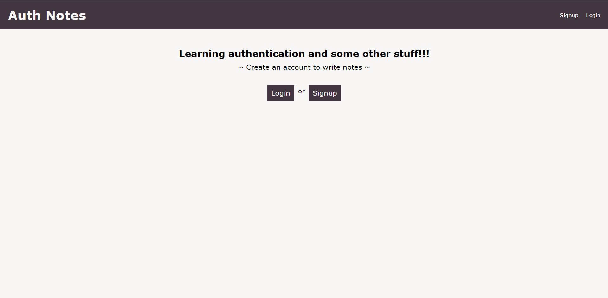
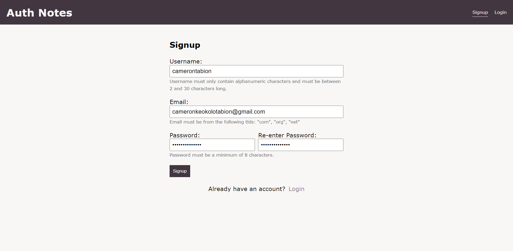
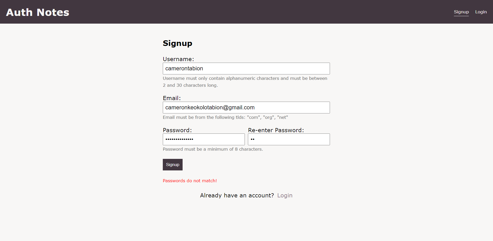
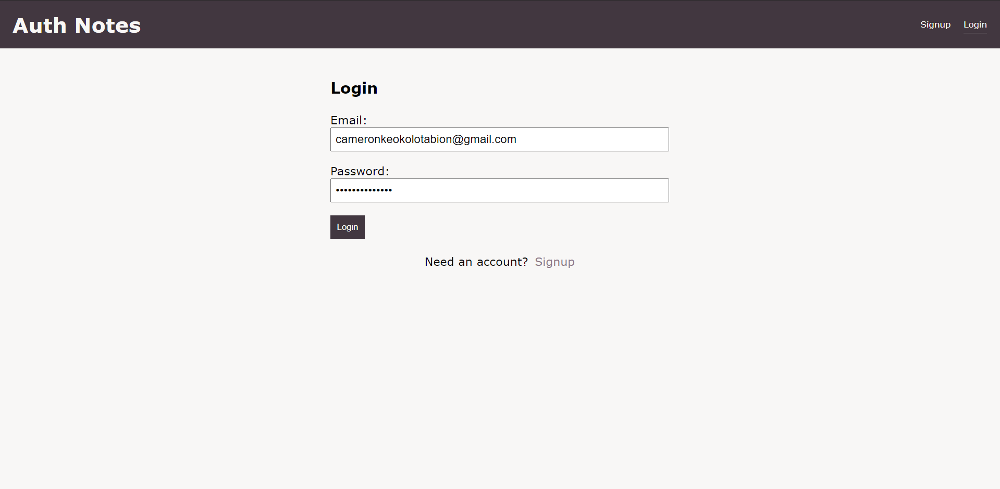
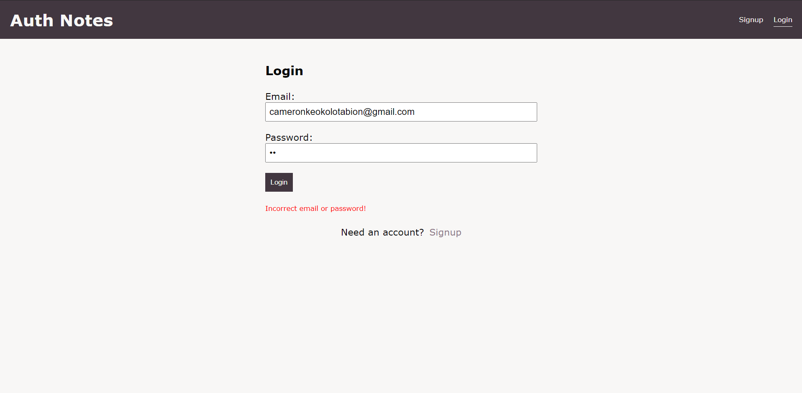
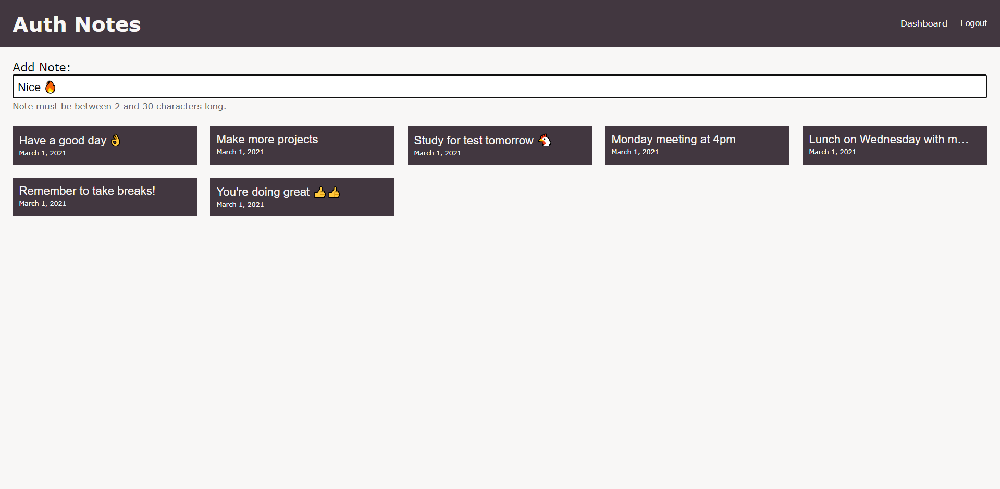
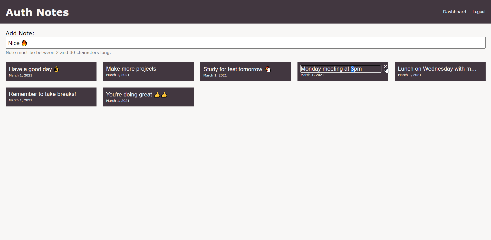

# Auth Notes
A practice full stack application with a login/signup system and server-side sessions.
Allows users to create an account and write small notes for reminders/todos.

## Tech Stack
* React
* Nodejs + Express
* MongoDB

## Screenshots

### Landing

### Signup

### Signup Error

### Login

### Login Error

### Dashboard - create notes

### Dashboard - update and delete notes
